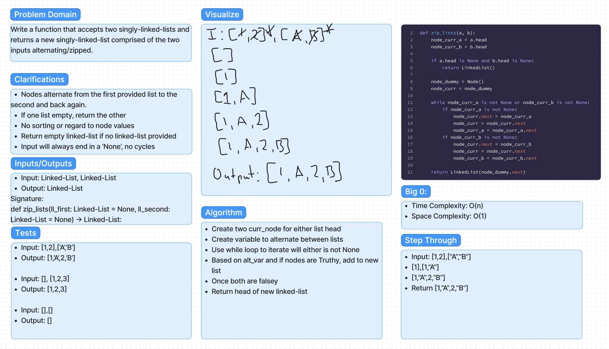

# Code-Challenges:

## Linked-List

### Title:
Linked-List-Zip

#### Date:
10-10-2023

#### Problem
Create a function to combine/zip two linked-lists together into one linked-list. Alternate between the first and second linked-lists provided.

#### Whiteboard

#### Approach & Efficiency
  * zip-lists():
    * Time Complexity: O(n)
    * Space Complexity: O(1)

