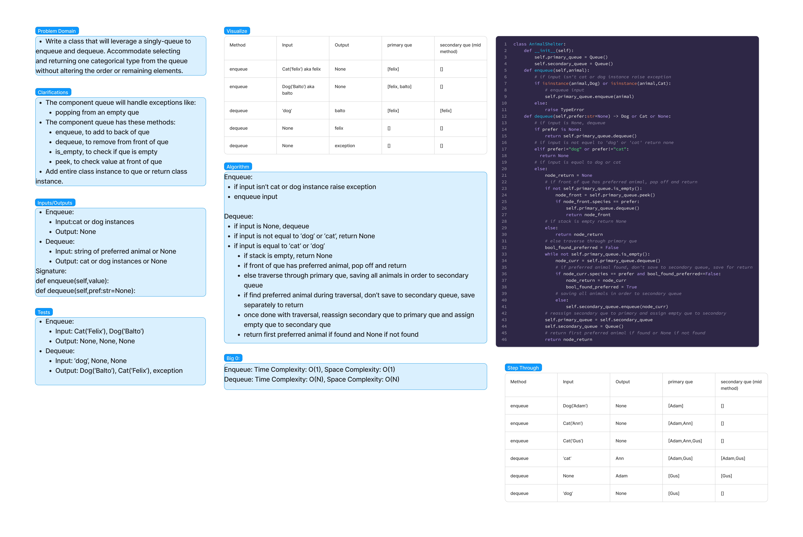
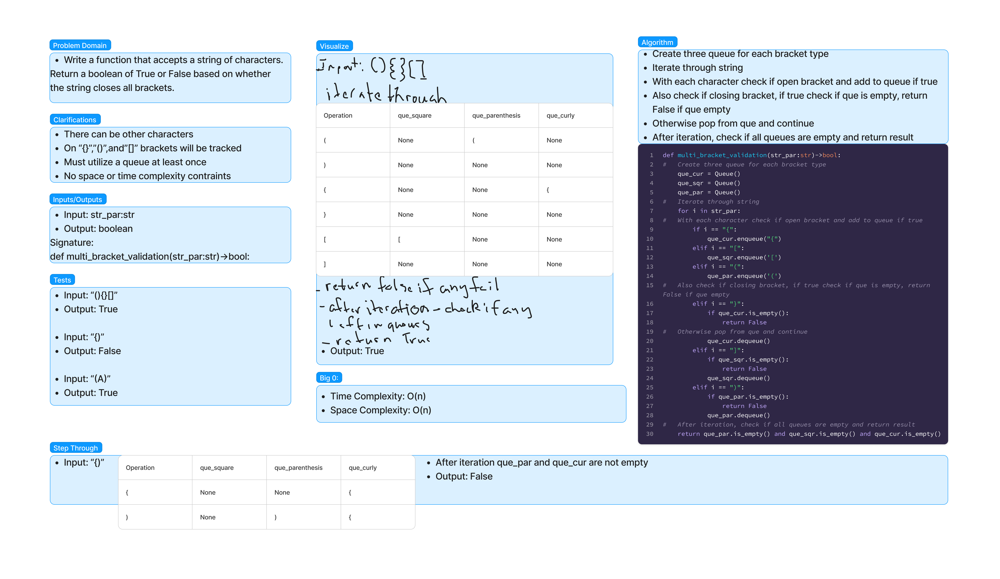

# Code-Challenges:

## Linked-List

### Title:
Linked-List-Zip

#### Date:
10-10-2023

#### Problem
Create a function to combine/zip two linked-lists together into one linked-list. Alternate between the first and second linked-lists provided.

#### Whiteboard


#### Approach & Efficiency
  * zip-lists():
    * Time Complexity: O(n)
    * Space Complexity: O(1)

## PseudoQueue

### Title:
PseudoQueue

#### Date:
10-19-2023

#### Problem
Create a 'PseudoQueue' class that leverages two Stack instances to implement a functional first-in, first-out queue, offering the 'enqueue' and 'dequeue' methods.

#### Whiteboard


#### Approach & Efficiency
  * PseudoQueue.enqueue():
    * Time Complexity: O(n)
    * Space Complexity: O(n)
  * PseudoQueue.dequeue():
    * Time Complexity: O(n)
    * Space Complexity: O(n)

## Animal Shelter Queue

### Title:
Animal Shelter Queue

#### Date:
10-22-2023


#### Problem
 Create a class that will leverage a singly-queue to enqueue and dequeue. Accommodate selecting and returning one categorical type from the queue without altering the order or remaining elements.

#### Whiteboard


#### Approach & Efficiency
  * AnimalShelter.enqueue():
    * Time Complexity: O(1)
    * Space Complexity: O(1)
  * AnimalShelter.dequeue():
    * Time Complexity: O(n)
    * Space Complexity: O(n)

## Multi Bracket Validation

### Title:
Multi Bracket Validation

#### Date:
10-26-2023

#### Problem
  Create a function that will accept a string and return a boolean if all the brackets are properly closed.

### Example

```python
# True
multi_bracket_validation("{}()[]")
# True
multi_bracket_validation("{([])}")
# False
multi_bracket_validation("[}")
# True
multi_bracket_validation("()[[Extra Characters]]")
```

#### Whiteboard


#### Approach & Efficiency
  * multi_bracket_validation():
    * Time Complexity: O(n)
    * Space Complexity: O(n)


