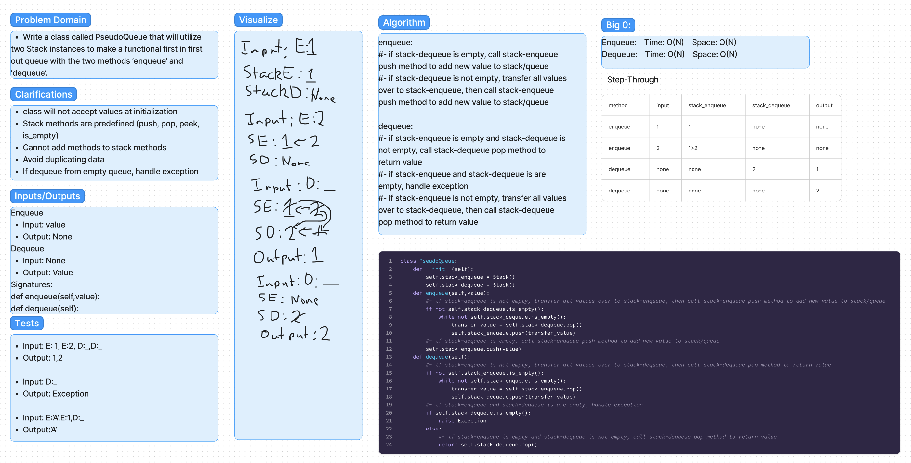

# Code-Challenges:

## Linked-List

### Title:
Linked-List-Zip

#### Date:
10-10-2023

#### Problem
Create a function to combine/zip two linked-lists together into one linked-list. Alternate between the first and second linked-lists provided.

#### Whiteboard

#### Approach & Efficiency
  * zip-lists():
    * Time Complexity: O(n)
    * Space Complexity: O(1)

## PseudoQueue

### Title:
PseudoQueue

#### Date:
10-19-2023

#### Problem
Create a 'PseudoQueue' class that leverages two Stack instances to implement a functional first-in, first-out queue, offering the 'enqueue' and 'dequeue' methods.

#### Whiteboard

#### Approach & Efficiency
  * PseudoQueue.enqueue():
    * Time Complexity: O(n)
    * Space Complexity: O(n)
  * PseudoQueue.dequeue():
    * Time Complexity: O(n)
    * Space Complexity: O(n)

