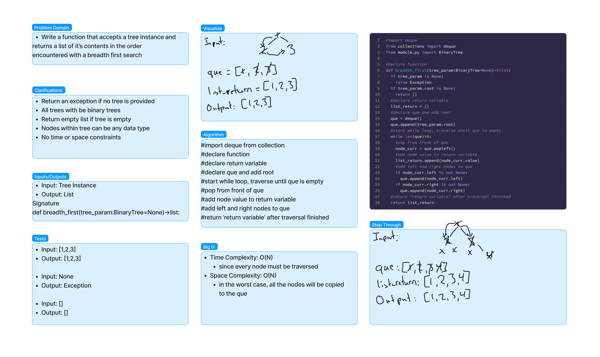
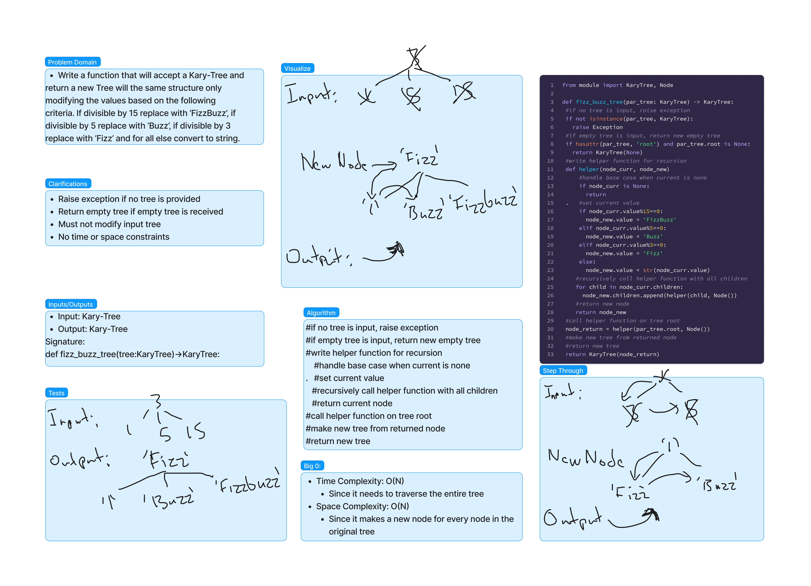
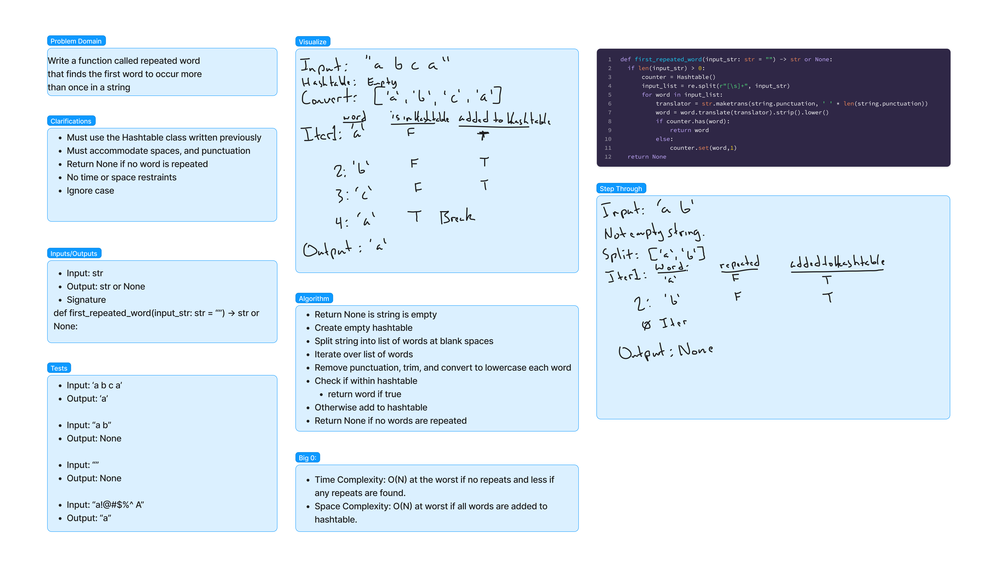
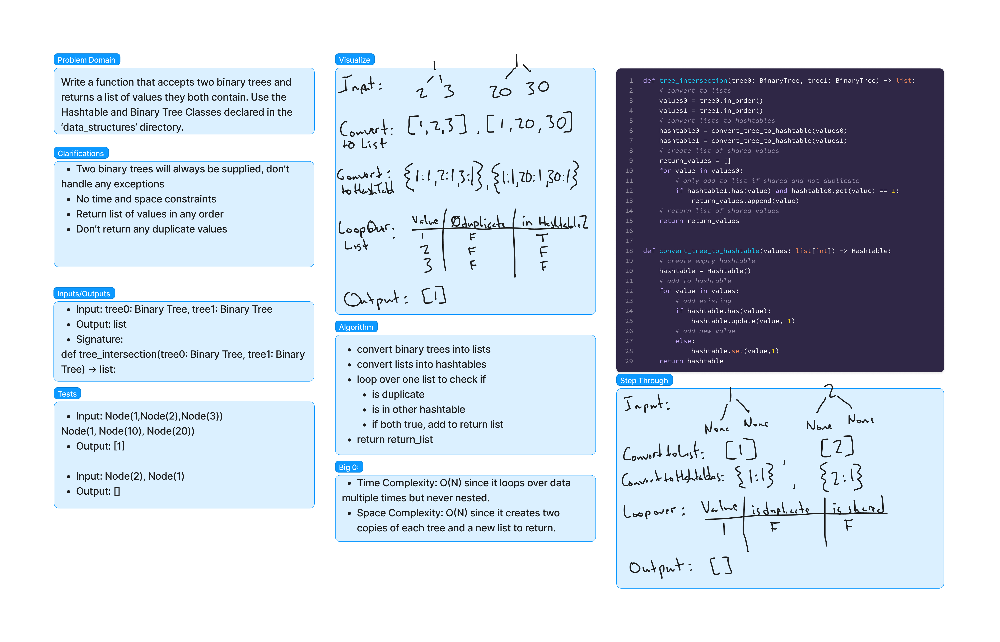
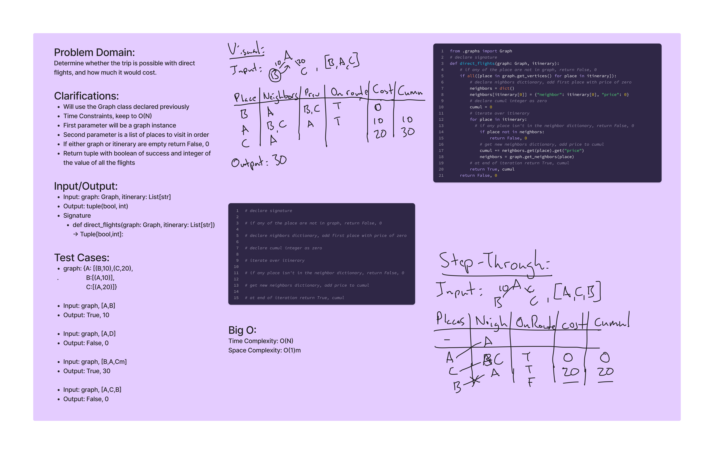

# Code-Challenges:

## Linked-List

#### Date:
10-10-2023

#### Problem
Create a function to combine/zip two linked-lists together into one linked-list. Alternate between the first and second linked-lists provided.

#### Whiteboard


#### Approach & Efficiency
  * zip-lists():
    * Time Complexity: O(n)
    * Space Complexity: O(1)

___

## PseudoQueue

#### Date:
10-19-2023

#### Problem
Create a 'PseudoQueue' class that leverages two Stack instances to implement a functional first-in, first-out queue, offering the 'enqueue' and 'dequeue' methods.

#### Whiteboard


#### Approach & Efficiency
  * PseudoQueue.enqueue():
    * Time Complexity: O(n)
    * Space Complexity: O(n)
  * PseudoQueue.dequeue():
    * Time Complexity: O(n)
    * Space Complexity: O(n)

___

## Animal Shelter Queue

#### Date:
10-22-2023

#### Problem
 Create a class that will leverage a singly-queue to enqueue and dequeue. Accommodate selecting and returning one categorical type from the queue without altering the order or remaining elements.

#### Whiteboard


#### Approach & Efficiency
  * AnimalShelter.enqueue():
    * Time Complexity: O(1)
    * Space Complexity: O(1)
  * AnimalShelter.dequeue():
    * Time Complexity: O(n)
    * Space Complexity: O(n)

___

## Multi Bracket Validation

#### Date:
10-26-2023

#### Problem
  Create a function that will accept a string and return a boolean if all the brackets are properly closed.

### Example

```python
# True
multi_bracket_validation("{}()[]")
# True
multi_bracket_validation("{([])}")
# False
multi_bracket_validation("[}")
# True
multi_bracket_validation("()[[Extra Characters]]")
```

#### Whiteboard


#### Approach & Efficiency
  * multi_bracket_validation():
    * Time Complexity: O(n)
    * Space Complexity: O(n)

___

## Tree Breadth First

#### Date:
11-8-2023

#### Problem
Write a function that accepts a tree instance and returns a list of it’s contents in the order encountered with a breadth first search.

#### Whiteboard


#### Approach & Efficiency
  * breadth_first(tree_param):
    * Time Complexity: O(N)
    * Space Complexity: O(N)

___

## Fizz-Buzz-Tree

#### Date:
11-11-2023

#### Problem
Write a function that will accept a Kary-Tree and
return a new Tree will the same structure only modifying the values based on the following criteria. If divisible by 15 replace with ‘FizzBuzz’, if divisible by 5 replace with ‘Buzz’, if divisible by 3 replace with ‘Fizz’ and for all else convert to string.

#### Whiteboard


#### Approach & Efficiency
  * fizz_buzz_tree(obj_tree):
    * Time Complexity: O(N)
    * Space Complexity: O(N)

___

## Hashtable Repeated Word

#### Date:
12-27-2023

#### Problem
Write a function called repeated word that finds the first word to occur more than once in a string.

#### Whiteboard


#### Approach & Efficiency
  * first_repeated_word(string_sentence):
    * Time Complexity: O(N)
    * Space Complexity: O(N)

___

## Tree Intersection

#### Date:
12-30-2023

#### Problem
Write a function that accepts two binary trees and returns a list of values they both contain. Use the Hashtable and Binary Tree Classes declared in the ‘data_structures’ directory.

#### Whiteboard


#### Approach & Efficiency
  * tree_intersection(tree0, tree1)
    * Time Complexity: O(N)
    * Space Complexity: O(N)
* convert_tree_to_hashtable(values)
    * Time Complexity: O(N)
    * Space Complexity: O(N)

___

## Hashmap Left Join

#### Date:
1-6-2024

#### Problem
Write a function that accepts two dictionaries/hashmaps and returns the left joined product of the two.

#### Whiteboard


#### Approach & Efficiency
  * left_join(first, second)
    * Time Complexity: O(N)
    * Space Complexity: O(N)

___

## Graphs Business Trip

#### Date:
1-19-2024

#### Problem
Write a function that accepts a Graph instance and list of string places. Returns a tuple of whether the itineary is possible and the cost.

#### Whiteboard


#### Approach & Efficiency
  * direct_flights(graph, [])
    * Time Complexity: O(N)
    * Space Complexity: O(1)


