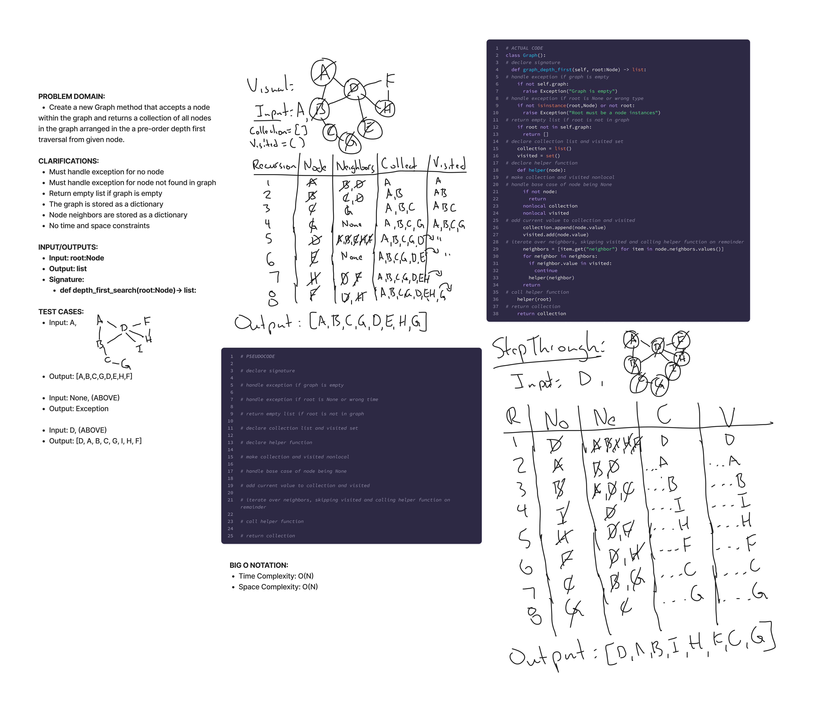

# Data Structures:

## Linked-List

### Title:
Linked-List Insert, Includes, __str__

### Date: 10-01-2023

### Problem
Write classes to create Node and Linked Lists instances.
Create methods to insert, search if value exists and to return string representation of the linked list.

### Approach & Efficiency
  * LinkedList.insert(value):
    * Time Complexity: O(1)
    * Space Complexity: O(1)
  * LinkedList.includes(value):
    * Time Complexity: O(n)
    * Space Complexity: O(1)
  * LinkedList.to_string()
    * Time Complexity: O(n)
    * Space Complexity: O(n)

___

## Linked-List-Insertions

### Date:
10/05/2023

### Problem
Create methods to delete a node,  insert a node at end of linked-list, insert a node before a node that matches a given value, and after the same matching node.

### Whiteboard

### Approach & Efficiency
  * LinkedList.append():
    * Time Complexity: O(n)
    * Space Complexity: O(1)
  * LinkedList.insert_before():
    * Time Complexity: O(n)
    * Space Complexity: O(1)
  * LinkedList.insert_after():
    * Time Complexity: O(n)
    * Space Complexity: O(1)
  * LinkedList.delete():
    * Time Complexity: O(n)
    * Space Complexity: O(1)

___

## Linked-List-Kth

### Date:
10/06/2023

### Problem
Find and return the kth from end node of the linked list.

### Whiteboard

### Approach & Efficiency
  * LinkedList.kth_from_end():
    * Time Complexity: O(n)
    * Space Complexity: O(n)

___

## Stack

### Date:
10/17/2023

### Problem
Make class to handle the creation of stack instances and their maintenance.

### Approach & Efficiency
  * Stack.push(value):
    * Time Complexity: O(1)
    * Space Complexity: O(1)
  * Stack.pop():
    * Time Complexity: O(1)
    * Space Complexity: O(1)
  * Stack.peek():
    * Time Complexity: O(1)
    * Space Complexity: O(1)
  * Stack.is_empty():
    * Time Complexity: O(1)
    * Space Complexity: O(0)

___

## Queue

### Date:
10/17/2023

### Problem
Make class to handle the creation of queue instances and their maintenance.

### Approach & Efficiency
  * Queue.enqueue(value):
    * Time Complexity: O(1)
    * Space Complexity: O(1)
  * Stack.dequeue():
    * Time Complexity: O(n)
    * Space Complexity: O(1)
  * Stack.peek():
    * Time Complexity: O(1)
    * Space Complexity: O(1)
  * Stack.is_empty():
    * Time Complexity: O(1)
    * Space Complexity: O(0)

___

## Binary Tree

### Date:
11/4/2023

### Problem
Make a class that can create and manage a binary tree. Must have methods to traverse the tree in a 'pre','post',and 'in'-order traversal; returning a list of the trees contents.

Also create a new Node class that has the attributes of 'value','left','right','count',and 'height'. These last two properties will come in handy for Binary Search Tree methods.

### Whiteboard

### Approach & Efficiency
  * BinaryTree.pre_order(value):
    * Time Complexity: O(N)
    * Space Complexity: O(N)
  * BinaryTree.in_order(value):
    * Time Complexity: O(N)
    * Space Complexity: O(N)
  * BinaryTree.post_order(value):
    * Time Complexity: O(N)
    * Space Complexity: O(N)

___

## Binary Search Tree

### Date:
11/4/2023

### Problem
Make a class that can create and manage a binary search tree while inheriting from the binary tree class. Must have a method to check if value exists in tree and another method add to binary search tree while maintaining balance and allow for duplication.

### Whiteboard

### Whiteboard for 'contains' method

### Whiteboard for 'add' method

### Approach & Efficiency
  * BinarySearchTree.contains(value):
    * Time Complexity: O(N)
    * Space Complexity: O(1)
  * BinaryTree.add():
    * Time Complexity: O(N)
    * Space Complexity: O(1)

___

## Binary Tree method Find Maximum Value

### Date:
11/5/2023

### Problem
Write another class method to the Binary Tree class that will return the maximum value of any instance of the class. Assume that tree only contain numerical values.

### Whiteboard

### Whiteboard for 'find_maximum_value' method

### Approach & Efficiency
  * BinaryTree.find_max_value():
    * Time Complexity: O(N)
    * Space Complexity: O(1)

___

## Hashtable:

### Date:
12/26/2023

### Problem
Writing a class that can hold and manage data like a dictionary. Data is stored in a list of lists and methods include set, get, has, hash, and keys which all function like their dictionary counterparts.

### Approach & Efficiency
  * Hashtable.get(key):
    * Time Complexity: O(N) (Worst case if all key-values pairs are in the same bucket.)
    * Time Complexity: O(1) (Best case if no key collisions.)
    * Space Complexity: O(1)
  * Hashtable.has(key):
    * Time Complexity: O(N) (Worst case if all key-values pairs are in the same bucket.)
    * Time Complexity: O(1) (Best case if no key collisions.)
    * Space Complexity: O(1)
  * Hashtable.hash(key):
    * Time Complexity: O(1)
    * Space Complexity: O(1)
  * Hashtable.keys():
    * Time Complexity: O(N) (Worse than n because it will need to check each bucket, empty or not.)
    * Space Complexity: O(N)
  * Hashtable.set(key, value):
    * Time Complexity: O(N) (Worst case if all key-values pairs are in the same bucket.)
    * Time Complexity: O(1) (Best case if no key collisions.)
    * Space Complexity: O(1)

___

## Graph

### Date:
1/17/2024

### Problem
Design a class for constructing a graph data structure. To increase its performance leverage the use of dictionaries inplace of lists wherever feasible. Define methods to manipulate the graph in the following ways: addition of vertices (add_vertex), addition of edges between vertices (add_edges), the retrieval of all neighboring vertices for a given vertex (get_neighbors), obtaining a list of all vertices within the graph (get_vertices), and determining the size of the graph (via size).

### Whiteboard for 'add_edge' method

### Approach & Efficiency
  * Graph.add_edge(vertex0, vertex1, 3):
    * Time Complexity: O(1)
    * Space Complexity: O(N)
  * Graph.add_vertex():
    * Time Complexity: O(1)
    * Space Complexity: O(1)
  * Graph.get_vertices():
    * Time Complexity: O(N)
    * Space Complexity: O(N)
  * Graph.get_neighbors(value):
    * Time Complexity: O(1)
    * Space Complexity: O(1)
  * Graph.size():
    * Time Complexity: O(1)
    * Space Complexity: O(1)

___

## Graph: Depth First Search

### Date:
1/23/2024

### Problem
Add a class method to the graph class that accepts a vertex instance and returns a list/collection of vertices connected directly and indirectly to that vertex. Sort the vertex values in a pre-order order from the input vertex.

### Whiteboard for 'depth_first_search' method

### Approach & Efficiency
  * Graph.depth_first_search(vertex):
    * Time Complexity: O(N) 
    * Space Complexity: O(N)

