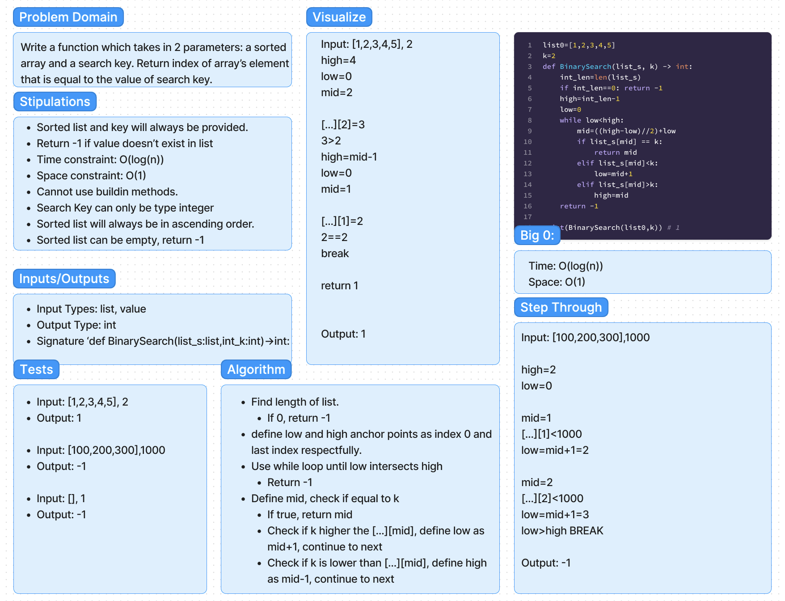
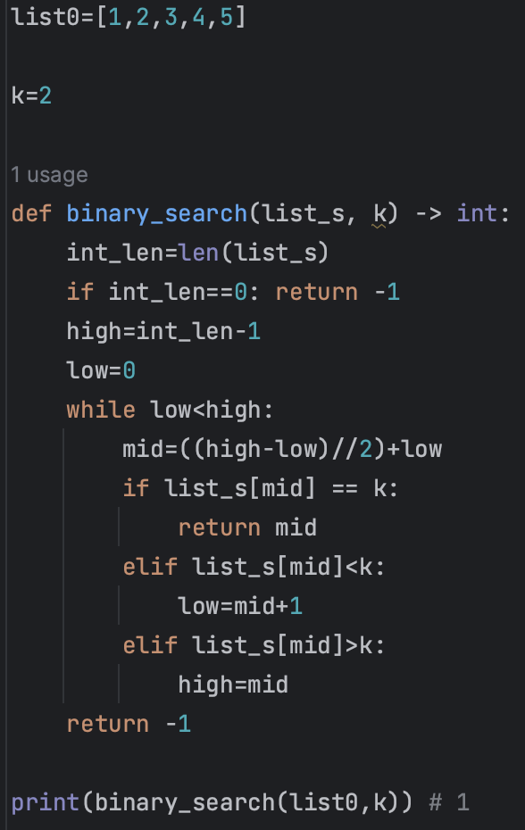

# Challenge Title
Whiteboard Exercise: List Binary Search

## Problem
Write a function that accepts a ascending sorted list of integers and search key integer, and returns the index of the value within the list equal to the key. Return -1 if not found. Do so with a binary search method in O(log(n)) time and O(1) space.

Whiteboard the above problem and return the whiteboard along with an example.

## Whiteboard Process


## Code Example


## Approach & Efficiency
Time Complexity: O(log(n))

Space Complexity: O(1)

## Solution
Example
```python
list0=[1,2,3,4,5]

k=2

def binary_search(list_s, k) -> int:
    int_len=len(list_s)
    if int_len==0: return -1
    high=int_len-1
    low=0
    while low<high:
        mid=((high-low)//2)+low
        if list_s[mid] == k:
            return mid
        elif list_s[mid]<k:
            low=mid+1
        elif list_s[mid]>k:
            high=mid
    return -1

print(binary_search(list0,k)) # 1


```


