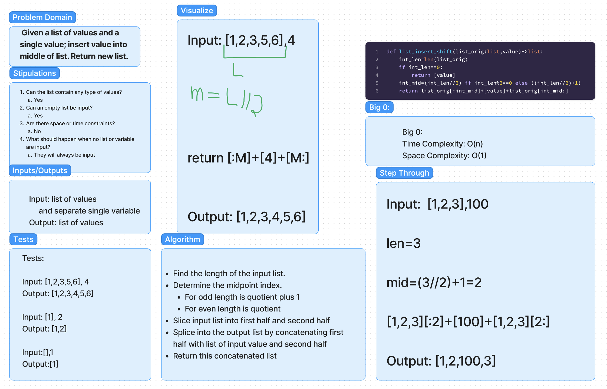
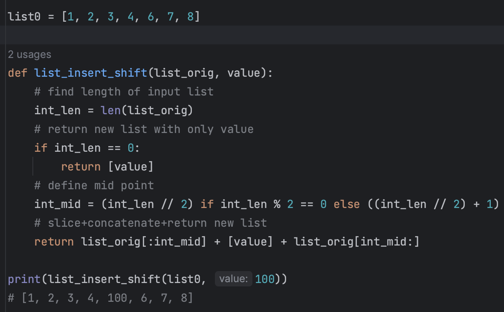

# Challenge Title
Whiteboard Exercise: List Insert Shift

## Problem
Write a function to accept a list and value; and returns a new list with the value inserted at the middle index.

## Whiteboard Process


## Code Example


## Approach & Efficiency
I found the length and middle index before slicing the original list and concatenating it together with a list of the new value.
Time Complexity: O(1)
Space Complexity: O(1)

## Solution
Example
```python
list0 = [1, 2, 3, 4, 6, 7, 8]

def list_insert_shift(list_orig, value):
    # find length of input list
    int_len = len(list_orig)
    # return new list with only value
    if int_len == 0:
        return [value]
    # define mid point
    int_mid = (int_len // 2) if int_len % 2 == 0 else ((int_len // 2) + 1)
    # slice+concatenate+return new list
    return list_orig[:int_mid] + [value] + list_orig[int_mid:]

print(list_insert_shift(list0, 100))
# [1, 2, 3, 4, 100, 6, 7, 8]
```


