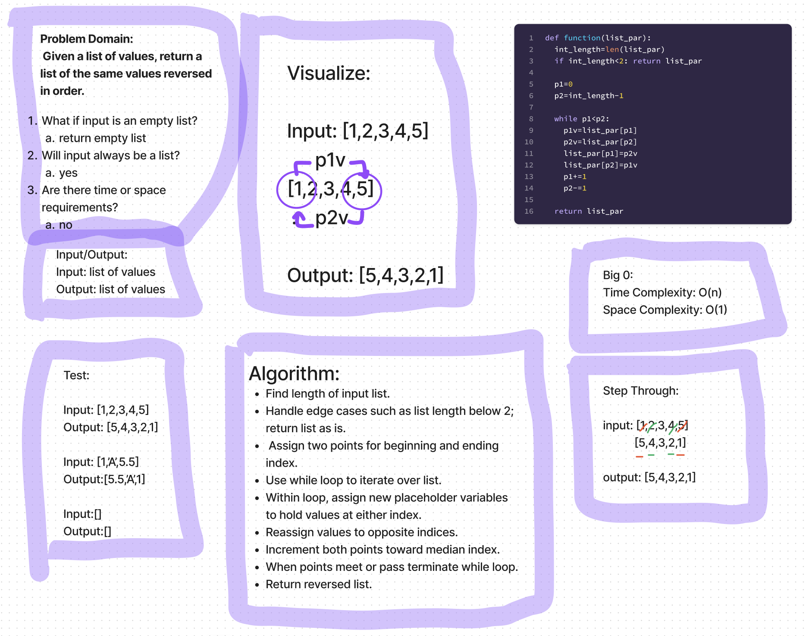
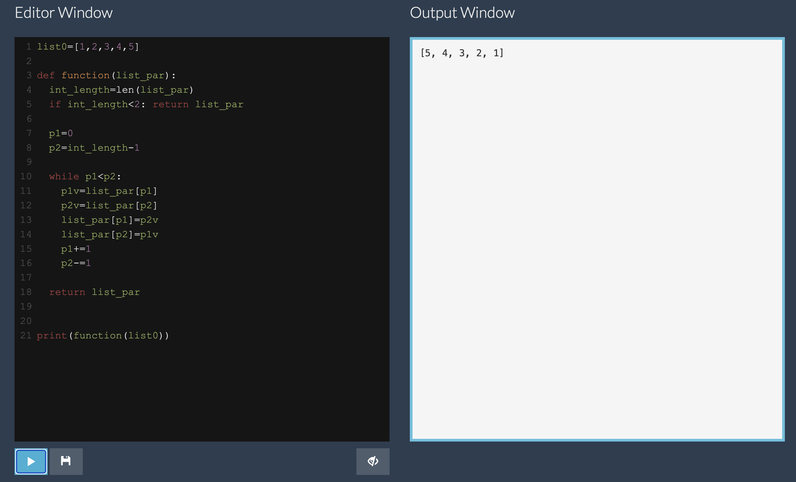

# Challenge Title
Whiteboard Exercise: Reverse List

## Problem
Write a function to accept a list and return a list with the same values but reversed.

## Whiteboard Process


## Code Example


## Approach & Efficiency
I used the two pointer method with a while loop since it should be the fastest method without a sorted list.
Time Complexity: O(n)
Space Complexity: O(1)

## Solution
Example
```python
list0=[1,2,3,4,5]

def function(list_par):
  int_length=len(list_par)
  if int_length<2: return list_par

  p1=0
  p2=int_length-1

  while p1<p2:
    p1v=list_par[p1]
    p2v=list_par[p2]
    list_par[p1]=p2v
    list_par[p2]=p1v
    p1+=1
    p2-=1

  return list_par


print(function(list0))
#[5,4,3,2,1]
```


