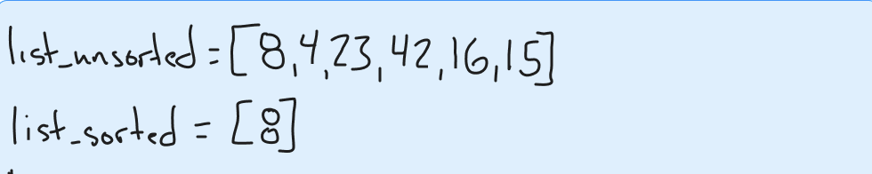
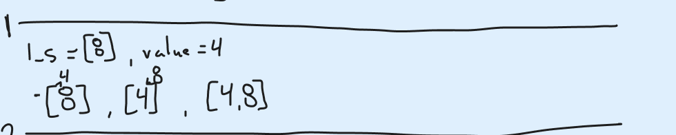
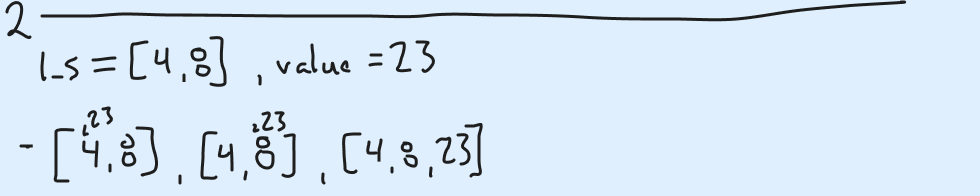
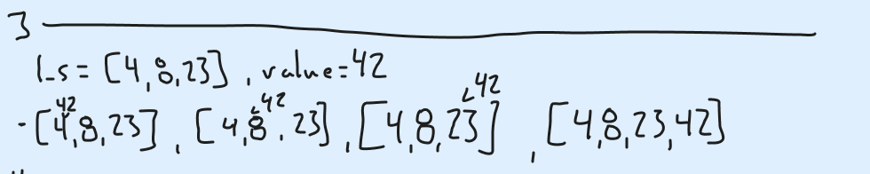
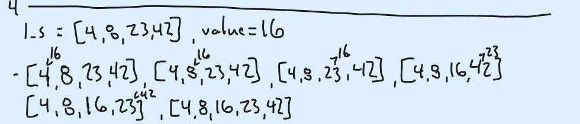
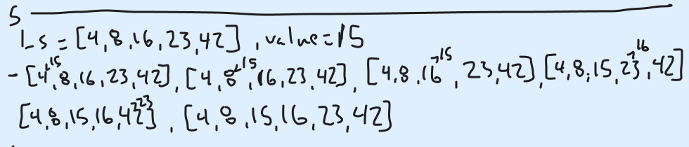
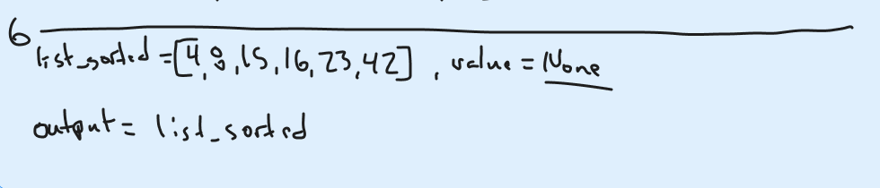

# Blog Notes: Insertion Sort

## Author: Jacob Bassett

## Date: 12-11-2023

## Problem:

How to perform Insertion Sort on the following list?

```python
list_unsorted = [8,4,23,42,16,15]
```

## Example:

1. Create a new list and add the 8 from the unsorted list.



2. Add 4 to the new list. Compare with 8, since it is smaller insert in it's place and append 8 to the end of the new list.



3. Add 23 to the new list. Compare to 4, it's larger so proceed to 8. Compare to 8, since it is larger and we are at the end of the new list, append 23 to end.



4. Add 42 to the new list. Compare it to 4, then 8, then 23; since it is larger than all of them and we have reached the end of the list we will append 42 to the end.



5. Add 16 to the new list. Compare it to 4, then 8, then 23; since it is smaller than 23 we will insert 16 in 23's place and proceed with 23. Comparing it to 42 it is smaller so we insert 23 in 42's place and proceed with 42. Since we are at the end of the list we append 42 to the new list.



6. Add 15 to the new list. Compare it to 4, then 8, then 16; since it is smaller than 16 we insert 15 in 16's place and proceed with 16. Compare it to 23, it is smaller so we insert 16 in 23's place and proceed with 23. Compare it to 42, since it is smaller we insert 23 in 42's place and proceed with 42. Since we are at the end of the list we append 42 to the new list.



7. Since there are no new values to append we return the new list.



## Code:

The code that follows the above steps to sort a list is...

```python
def insertion(list_sorted: list[int], insertion_value: int) -> list[int]:
    # start at the lowest value of the sorted list
    for index, temporary_value in enumerate(list_sorted):
        # if the insertion value is less than the current value
        if insertion_value < temporary_value:
            # insert the insertion value
            list_sorted[index] = insertion_value
            # make the old value the new insertion value
            insertion_value = temporary_value
    # add the remaining insertion value to the end of the sorted list
    list_sorted.append(insertion_value)
    return list_sorted


def insertion_sort(list_unsorted: list[int]) -> list[int]:
    # create new sorted list and add first value from unsorted list
    list_sorted = [list_unsorted[0]]
    # add the rest of the values from the unsorted list to the sorted list one at a time
    for i in range(1, len(list_unsorted)):
        insertion_value = list_unsorted[i]
        # with each addition to the sorted list follow the following steps
        list_sorted = insertion(list_sorted, insertion_value)
    # return sorted list
    return list_sorted
```


## Tests:

Can run the following tests to verify that function works as advertised.

```python
if __name__ == "__main__":
    list_lists = list()
    list_lists.append([20, 18, 12, 8, 5, -2])
    list_lists.append([5, 12, 7, 5, 5, 7])
    list_lists.append([2, 3, 5, 7, 13, 11])

    for unsorted in list_lists:
        expected = sorted(unsorted)
        actual = insertion_sort(unsorted)
        assert expected == actual
```
