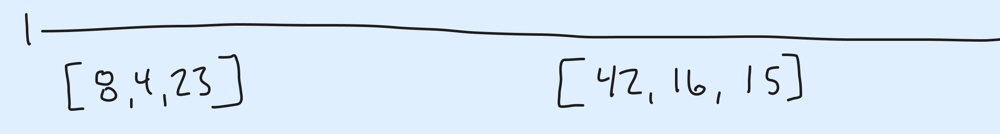
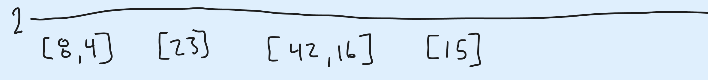
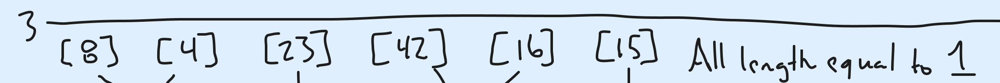
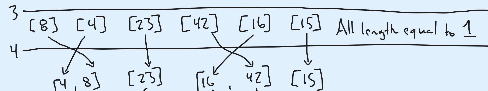
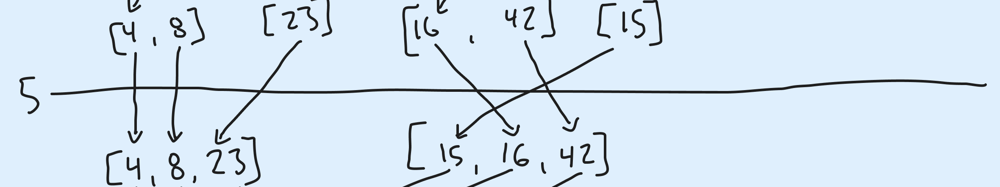
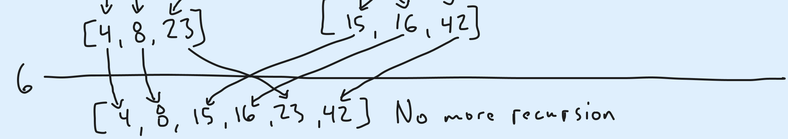
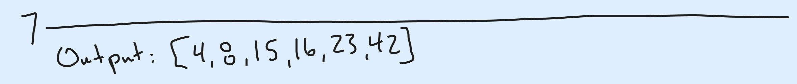

# Blog Notes: Merge Sort

## Author: Jacob Bassett

## Date: 12-13-2023

## Problem:

How to perform Merge Sort of the following list?

```python
list_unsorted = [8,4,23,42,16,15]
```

## Pseudocode:

Here is an example of how to perform merge sort only in pseudocode.

```
ALGORITHM Mergesort(arr)
    DECLARE n <-- arr.length

    if n > 1
      DECLARE mid <-- n/2
      DECLARE left <-- arr[0...mid]
      DECLARE right <-- arr[mid...n]
      // sort the left side
      Mergesort(left)
      // sort the right side
      Mergesort(right)
      // merge the sorted left and right sides together
      Merge(left, right, arr)

ALGORITHM Merge(left, right, arr)
    DECLARE i <-- 0
    DECLARE j <-- 0
    DECLARE k <-- 0

    while i < left.length && j < right.length
        if left[i] <= right[j]
            arr[k] <-- left[i]
            i <-- i + 1
        else
            arr[k] <-- right[j]
            j <-- j + 1

        k <-- k + 1

    if i = left.length
       set remaining entries in arr to remaining values in right
    else
       set remaining entries in arr to remaining values in left
```

## Example:

1. Input new list. [8, 4, 23, 42, 16, 15]


2. Split into left and right halves. Only stopping when length is equal to one. [8, 4, 23], [42, 16, 15]



3. Split sublists into left and right halves again. [8, 4], [23], [42, 16], [15]



4. Split sublists into left and right haves again. Now that all lists lengths are equal to one, initiate merge sorting. [8], [4], [23], [42], [16], [15]



5. Select the first value of each sublist and compare. Add the lowest value to the new list first. Continue this until all values from each sublist are combined into a new sorted sublist. [4, 8], [23], [16, 42], [15]



6. Merge each sorted sublist again following the same criteria to form a larger sorted sublist. [4, 8, 23], [15, 16, 42]



7. Merge each sorted sublist again following the same criteria to form a larger sorted sublist. [4, 8, 15, 16, 23, 42]



8. Now that there are no further sublists to merge, return sorted list. [4, 8, 15, 16, 23, 42]



## Code:

The code that follows the above steps to sort a list is...

```python
# use deque to get around using index pointers within merge function
from collections import deque

def merge_sort(unsorted: list[int]) -> list[int]:
    # generate new input list rather than change input variable
    list_input = unsorted
    list_sorted = []
    # continue splitting list into left and right until length is equal to one
    if len(list_input) > 1:
        # split into left and right sublists
        int_mid = len(list_input) // 2
        list_left = list_input[0:int_mid]
        list_right = list_input[int_mid:]
        # recursively continue split
        list_left = merge_sort(list_left)
        list_right = merge_sort(list_right)
        # as sorted sublists are returned, continue sorting while merging
        list_sorted = merge(list_left, list_right)
    # if length is equal to one return as is
    # if larger, return sorted sublist
    return list_sorted or list_input


def merge(left: list[int], right: list[int]) -> list[int]:
    # leverage deque to avoid using index pointers
    que_left = deque(left or [])
    que_right = deque(right or [])
    que_return = deque()
    # add lowest value from left or right sublist
    # until either sublist is exhausted
    while len(que_left) > 0 and len(que_right) > 0:
        if que_left[0] < que_right[0]:
            que_return.append(que_left.popleft())
        else:
            que_return.append(que_right.popleft())
    # add remainder of left or right sublist and return sorted sublist
    if len(que_left) == 0:
        return [*que_return, *que_right]
    else:
        return [*que_return, *que_left]
```


## Tests:

Run the following command to verify that merge_sort function works properly.

```bash
pytest
```
